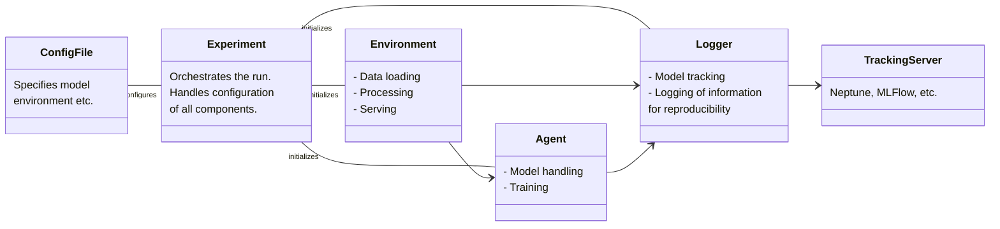

# MooClassification

## Project Description
OptiLearn, a collaboration between [Spryfox](https://spryfox.de/) and the Technical University of Darmstadt, is publicly funded by the LOEWE3 program. This cutting-edge machine learning framework leverages Multi-Objective Optimization (MOO) to enable agents to optimize conflicting objectives based on user-defined preferences. Unlike traditional ML systems that require retraining for behavioral shifts, OptiLearn ensures seamless adaptability, dynamically adjusting behavior within set parameters. The framework supports diverse outputs like classifications, detections, and data-specific confidence metrics, offering a comprehensive and versatile solution to evolving machine learning challenges.

MooClassification is a Python package for multi-objective classification tasks. It provides a flexible framework for defining and running experiments with various models, data loaders, and evaluation metrics.

## Table of Contents
- [Getting Started](#getting-started)
  - [Prerequisites](#prerequisites)
  - [Installation](#installation)
  - [Running Tests](#running-tests)
  - [Running an Experiment](#running-an-experiment)
  - [Examples and Tutorials](#examples-and-tutorials)
- [Project Structure](#project-structure)
- [Experiment Structure](#experiment-structure)
  - [Components](#components)
  - [Relationships](#relationships)
- [Supported Features](#supported-features)
- [License](#License)
- [Acknowledgments](#acknowledgments)
- [FAQ](docs/faq.md)
- [Code of Conduct](docs/code_of_conduct.md)
- [Contributing](CONTRIBUTING.md)

## Getting Started

### Prerequisites
- Python 3.10.8+
- Pyenv
- Poetry

[Pyenv](https://github.com/pyenv/pyenv) is a tool used to manage multiple versions of Python on a single machine. It allows you to easily switch between different Python versions, which is useful for testing and running projects that require specific versions of Python.  

[Poetry](https://python-poetry.org/docs/) is a dependency management and packaging tool for Python. It simplifies the process of managing project dependencies, packaging, and publishing Python projects. Poetry uses a pyproject.toml file to specify dependencies and other project settings.

### Installation
Make sure Pyenv and Poetry are properly installed.

Install Python 3.10.8+ using pyenv
```bash
pyenv install 3.10.8
```

```bash
cd existing_repo
git remote add origin https://gitlab.com/spryfox/optilearn/multi-objective-optimization.git
git branch -M main
git push -uf origin main
```


Set-up a virtual environment: 
```bash
poetry env use $(pyenv local)
poetry install
```

More detailed installation instructions can be found in the [installation guide](docs/installation.md).
### Running Tests
To run tests, use the following command:
```bash
poetry run pytest
```
### Setting Up the Logging Server
[Neptune](https://app.neptune.ai/) is used for logging and experiment tracking because it provides a centralized platform for tracking experiments, collaboration, visualization, integration, scalability, and versioning. This enhances the efficiency and effectiveness of managing machine learning projects. 

To set up neptune logging server, modify the following line to the `configs/constants.py` file:
``` python
PROJECT = "your_neptune_work_space/YourProject"
```
Provide your Neptune API key as an environment variable:
```bash
export NEPTUNE_API_TOKEN="xxxx"
```
You can get your Neptune API key from the Neptune dashboard.

### Running an Experiment
You can run an experiment by executing the `run_training.py` script located in the `scripts/` directory. For example:
```bash
poetry run python scripts/run_training.py
```
### Examples and Tutorials
For more examples and tutorials, refer to the [Examples and Tutorials](docs/examples.md) section.

## Project Structure
The project is organized as follows:

- `moo_classification/`: Main package containing all the core modules.
  - `agent.py`: Contains the `Agent` class.
  - `base_object.py`: Contains base classes like `BaseDataClass` and `BaseObject`.
  - `environments/`: Contains environment-related classes and data loaders.
    - `data_loaders/`: Contains data loader classes and transformation pipelines.
  - `evaluation/`: Contains evaluation, logging, and visualization classes.
  - `experiment.py`: Contains the `Experiment` class.
  - `models/`: Contains model classes.
  - `utils/`: Contains utility functions and loss functions.
- `scripts/`: Contains scripts for running training and other tasks.
  - `run_training.py`: Script to run the training process.
- `configs/`: Directory for configuration files.
- `README.md`: Project documentation and setup instructions.
- `pyproject.toml`: Project configuration file for dependencies and settings.

## Experiment Structure

This document outlines the structure of an experiment, including its main components and relationships.

### Components

- **Experiment**
    - Responsible for orchestrating the entire run of the experiment.
    - Manages the configuration and initialization of each component (Environment, Agent, Logger).
  
- **Environment**
    - Handles data loading, processing, and serving tasks necessary for the experiment.

- **Agent**
    - Manages the model, including handling and training processes.

- **Logger**
    - Tracks the experiment's progress and logs essential information for reproducibility.

- **TrackingServer**
    - External tool or server (e.g., Neptune, MLFlow) used for advanced experiment tracking and monitoring.

- **ConfigFile**
    - Provides configuration details for the experiment, such as model specifications and environment settings.


### Relationships
- ConfigFile: Configures the Experiment, defining model and environment details.
- Experiment: Initializes Environment, Agent, and Logger components.
- Environment: Connects to both Agent and Logger for data processing and tracking.
- Agent: Interacts with Logger to document model training progress.
- Logger: Links to TrackingServer to store logs and track the experiment.

This structure allows for a modular and organized approach to experiment management, with each component fulfilling a specific role and enabling efficient tracking, logging, and model handling.



## Supported Features
- Custom modules for:
  - Data loaders
  - Models
  - Evaluation metrics
  - Loss functions
  
- Multi-objective classification tasks
- Single-objective classification tasks
- Model types: 
  - neural networks (MLP, CNN, pretrained models)
  - decision trees (LGBM, etc.)
  - SkLearn models (random forests, etc.)
- Environment types: 
  - image classification
  - tabular data classification
  
## License
MIT License
Copyright 2024 Spryfox, Gmbh

Permission is hereby granted, free of charge, to any person obtaining a copy of this software and associated documentation files (the “Software”), to deal in the Software without restriction, including without limitation the rights to use, copy, modify, merge, publish, distribute, sublicense, and/or sell copies of the Software, and to permit persons to whom the Software is furnished to do so, subject to the following conditions:

The above copyright notice and this permission notice shall be included in all copies or substantial portions of the Software.

THE SOFTWARE IS PROVIDED “AS IS”, WITHOUT WARRANTY OF ANY KIND, EXPRESS OR IMPLIED, INCLUDING BUT NOT LIMITED TO THE WARRANTIES OF MERCHANTABILITY, FITNESS FOR A PARTICULAR PURPOSE AND NONINFRINGEMENT. IN NO EVENT SHALL THE AUTHORS OR COPYRIGHT HOLDERS BE LIABLE FOR ANY CLAIM, DAMAGES OR OTHER LIABILITY, WHETHER IN AN ACTION OF CONTRACT, TORT OR OTHERWISE, ARISING FROM, OUT OF OR IN CONNECTION WITH THE SOFTWARE OR THE USE OR OTHER DEALINGS IN THE SOFTWARE.
## Acknowledgment
This project was made possible through the combined efforts and expertise of several organizations and contributors:

- Spryfox: Provided expertise in software engineering and data-science.
- University of Darmstadt, Self-Organizing Systems Lab: Contributed scientific knowledge and resources to the development of the project.
- LOEWE3: This project (HA project no. 1397/22-102) is financed with funds of LOEWE – Landes-Offensive zur Entwicklung Wissenschaftlich-ökonomischer Exzellenz, Förderlinie 3: KMU-Verbundvorhaben (State Offensive for the Development of Scientificand Economic Excellence).

## FAQ
For frequently asked questions, refer to the [FAQ](docs/faq.md) section.

## Code of Conduct
Please refer to the [Code of Conduct](docs/code_of_conduct.md) for guidelines on contributing to this project.

## Contributing
For information on how to contribute to this project, please refer to the [Contributing](contributing.md) guidelines.